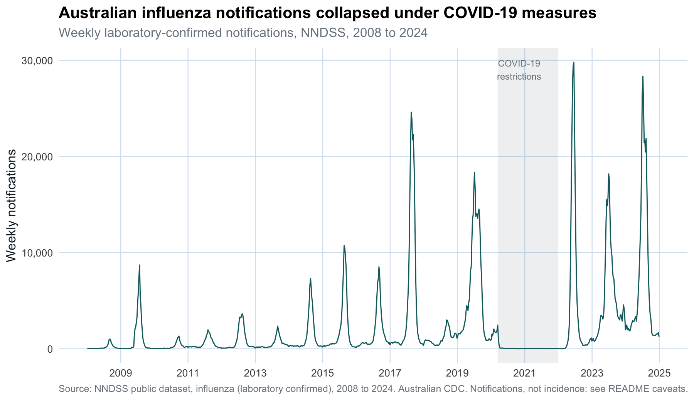
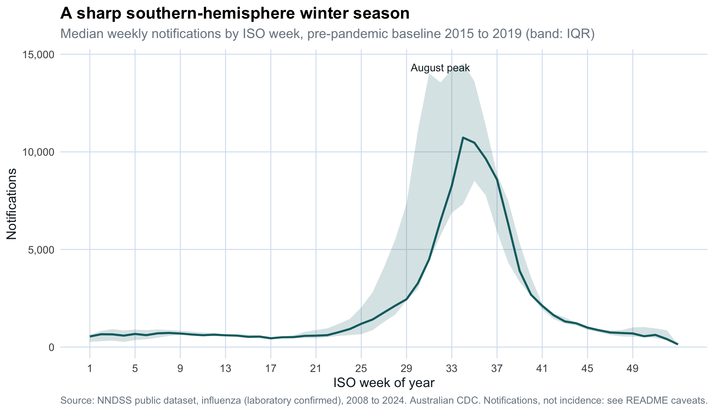
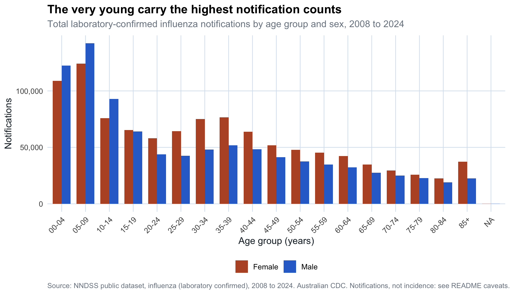
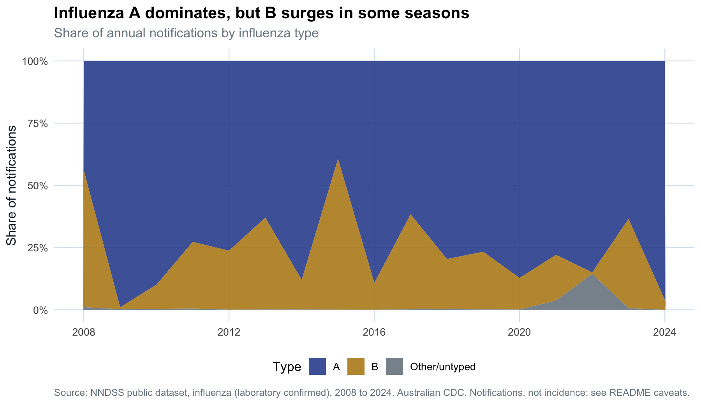
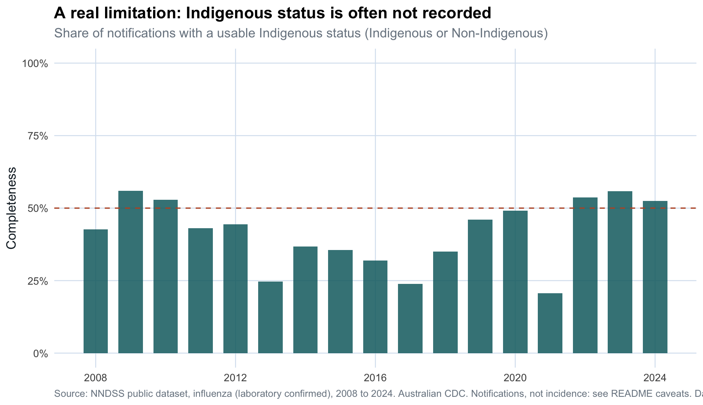
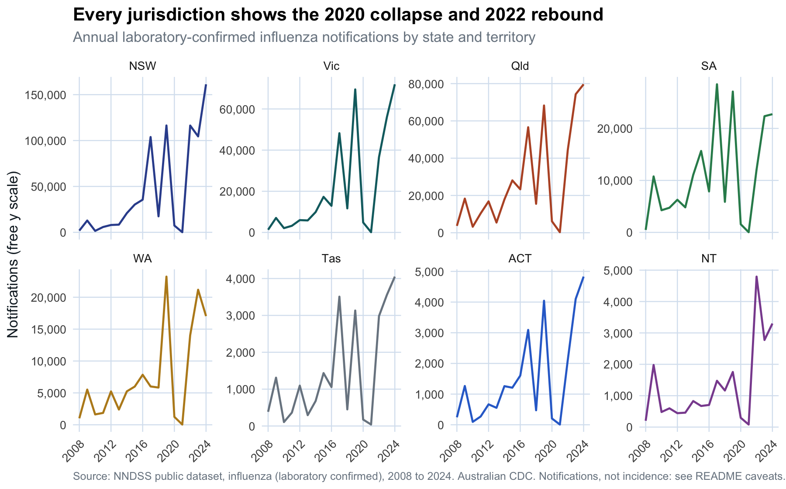
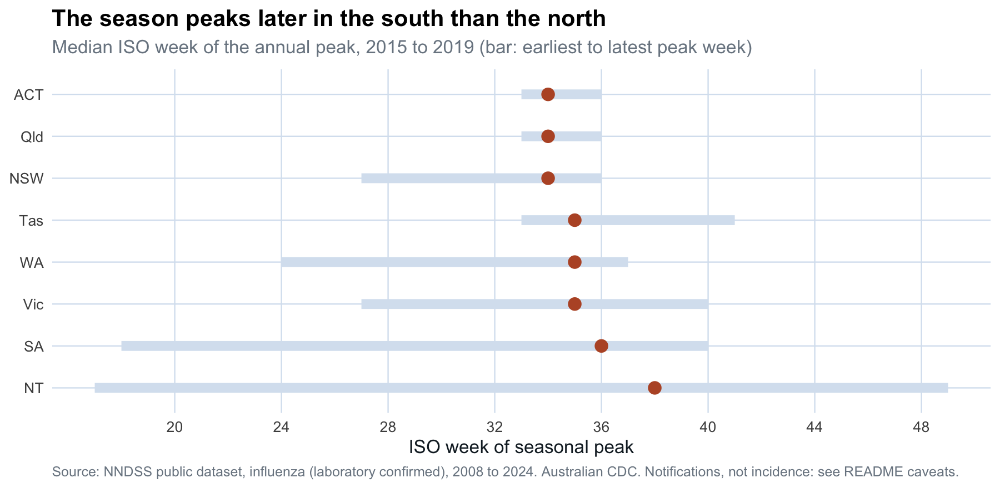
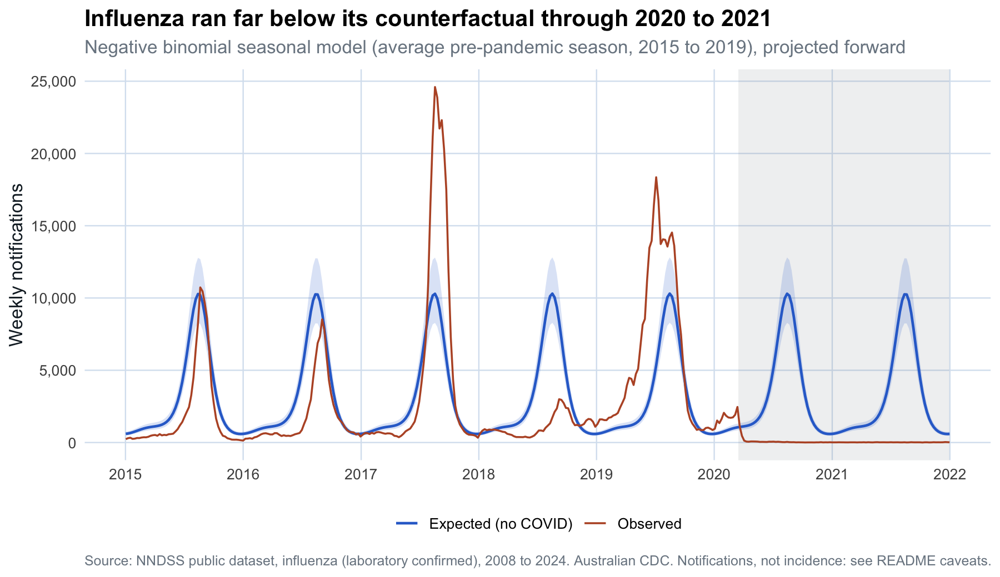

# Australian influenza: a descriptive-triad and interrupted-time-series analysis

A reproducible statistical-epidemiology project on **1.97 million laboratory-confirmed
influenza notifications in Australia, 2008 to 2024**, from the National Notifiable
Diseases Surveillance System (NNDSS).

The analysis is organised around the classic epidemiologic descriptive triad,
**person, place, and time**, and then adds one analytic step: an interrupted
time series that quantifies the collapse of influenza during the COVID-19
restrictions.

Everything runs from raw public data with one command, and the small processed
tables and all figures are committed, so the results are browsable without
running anything.

## Headline findings

- **Influenza notifications fell to near zero under COVID-19 measures.** Against a
  seasonal counterfactual of about 161,000 notifications a year, observed notifications
  were **86% lower in 2020** (21,881) and **more than 99% lower in 2021** (760).
- **The rebound overshot.** 2022 to 2024 produced the largest seasons on record,
  peaking at **364,922 notifications in 2024**, above the previous 2019 high of 313,414.
- **The season is a sharp southern-hemisphere winter epidemic**, peaking around
  ISO week 32 (early August), and **peaks later in the southern states than the north**.
- **The young carry the highest notification counts**, and influenza A dominates,
  with influenza B surging in particular seasons (for example 2017).
- **A real data limitation, made explicit:** Indigenous status is usable for only
  about **41% of notifications on average**, so this project does not draw
  conclusions about First Nations disparities from this field.

## The triad, and the figures

### Time



### Person




### Place



### Analytic step: interrupted time series


A negative binomial GLM with harmonic seasonal terms is fit to the pre-pandemic
years (2015 to 2019) and projected forward. No secular time trend is included,
because influenza notifications are episodic rather than trending; the
counterfactual is therefore "an average pre-pandemic season". The gap between the
observed line and this expectation through 2020 and 2021 is the size of the
disruption.

## Reproduce it

Requires R (4.1 or newer). From the project root:

```r
# installs any missing packages, then runs every step
Rscript run_all.R
```

This will:
1. `R/01_download.R` download the NNDSS influenza workbook (~47 MB) into `data/raw/` (gitignored).
2. `R/02_clean.R` read the four line-list sheets, harmonise them, and write small tidy aggregates to `data/processed/`.
3. `R/03`–`R/05` build the person, place and time figures.
4. `R/06` fit and project the interrupted time series.

Run the checks with:

```r
Rscript tests/testthat.R
```

## Layout

```
R/
  00_setup.R                install and load packages
  utils.R                   paths, shared ggplot theme, palette
  01_download.R             fetch the raw NNDSS workbook
  02_clean.R                line list -> tidy weekly/annual aggregates
  03_descriptive_time.R     epidemic curve, seasonality
  04_descriptive_person.R   age, sex, subtype, data completeness
  05_descriptive_place.R    state trends, peak timing
  06_interrupted_timeseries.R  negative binomial counterfactual
data/
  raw/          gitignored 47 MB workbook (re-downloadable)
  processed/    small tidy CSVs, committed
outputs/
  figures/      all figures (committed)
  tables/       result tables (committed)
tests/          testthat sanity checks on the processed data
run_all.R       one-command reproduction
```

## Data source

National Notifiable Diseases Surveillance System (NNDSS) public dataset,
**influenza (laboratory confirmed)**, published by the Australian Centre for
Disease Control. Record-level line list by week-ending date, state or territory,
age group, sex, Indigenous status, and influenza type or subtype.

- Landing page: https://www.cdc.gov.au/resources/collections/nndss-public-datasets
- The public dataset is updated in July each year to add the previous year's notifications.

## Caveats (why this is notifications, not incidence)

These caveats are the point of the project as much as the trends are. Working
with Australian surveillance data means working around them honestly.

1. **Notifications are not incidence.** A notification requires a person to seek
   care, be tested, test positive, and be reported. Testing effort changes over
   time (notably a large rise after 2016 and again post-2022), so part of the
   long-run increase reflects more testing, not only more disease.
2. **No denominators here.** Counts are not population-adjusted. Comparing states
   by count reflects population size as much as risk. Proper rate and
   age-standardised analysis needs ABS Estimated Resident Population denominators;
   that is a documented extension, deliberately not faked with invented numbers.
3. **Incomplete fields.** Indigenous status is usable for only ~41% of records on
   average, so it is reported as a data-quality measure, not analysed for disparities.
   Sex has a small "other/unknown" group.
4. **Changing case definitions and systems.** Subtyping practice changed over the
   period (much is recorded as "A unsubtyped"), and administration of the NNDSS
   moved to the new Australian CDC, so URLs and formats can change.
5. **Reporting lag and revision.** Recent weeks are revised upward as late
   notifications arrive; the final partial week of 2025 is dropped.

## Licence

MIT, see [LICENSE](LICENSE). The NNDSS data is Australian Government public data,
subject to its own terms on the source page.
